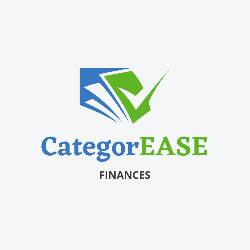

<a name="readme-top"></a>

<div align="center">
  
</div>

<a name="readme-top"></a>

# 📗 Table of Contents

- [📖 About the Project](#about-project)
  - [🛠 Built With](#built-with)
    - [Tech Stack](#tech-stack)
- [💻 Getting Started](#getting-started)
  - [Setup](#setup)
  - [Prerequisites](#prerequisites)
  - [Install](#install)
  - [Usage](#usage)
  - [Run tests](#run-tests)
  - [Deployment](#triangular_flag_on_post-deployment)
- [👥 Authors](#authors)
- [🔭 Future Features](#future-features)
- [🤝 Contributing](#contributing)
- [⭐️ Show your support](#support)
- [🙏 Acknowledgements](#acknowledgements)
- [📝 License](#license)

<!-- PROJECT DESCRIPTION -->

# 📖 CategorEASE App <a name="about-project"></a>

CategorEASE is a comprehensive mobile web application designed to simplify expense tracking and budget management for individuals and households. It provides users with a user-friendly platform to efficiently categorize, monitor, and analyze their expenses, helping them make informed financial decisions.

## 🛠 Built With <a name="built-with"></a>

### Tech Stack <a name="tech-stack"></a>

<details>
<summary>Ruby</summary>
  <ul>
    <li><a href="https://www.ruby-lang.org/">Ruby</a></li>
  </ul>
</details>

<details>
<summary>Rails</summary>
  <ul>
    <li><a href="https://rubyonrails.org/">Rails</a></li>
  </ul>
</details>

<details>
<summary>Rspec</summary>
  <ul>
    <li><a href="https://rspec.info/">Rspec</a></li>
  </ul>
</details>

<details>
<summary>Capybara</summary>
  <ul>
    <li><a href="https://teamcapybara.github.io/capybara/">Capybara</a></li>
  </ul>
</details>

<p align="right">(<a href="#readme-top">back to top</a>)</p>

## 💻 Getting Started <a name="getting-started"></a>


### Setup <a name="setup"></a>

1. Ensure you have Ruby 3.2.2 at least, installed on your system. You can check your Ruby version in the terminal by running:

```
ruby -v
```

If Ruby is not installed, you can download and install it from the official Ruby website.

2. To get a local copy up and running, follow these steps.
   Choose the directory on your local machine where you want to copy project. For example:

```
cd /home/user/name-of-your-directory
```

Clone the project using one of the options.

Using SSH-key:

```
git@github.com:Alejuda/CategorEASE.git
```

Using HTTPS:

```
https://github.com/Alejuda/CategorEASE.git
```

### Installation <a name="install"></a>

To run this project locally, follow these steps:

1. Open your terminal or command prompt.

2. Navigate to the directory where you have cloned or downloaded the Recipe App repository.

3. Run the following command to install any required dependencies (in this case, we assume there are no external dependencies, so this step may not be needed):

```
bundle install
```

### Usage <a name="usage"></a>

1. Once the setup is complete, ensure you are still in the directory containing the Recipe App files.

2. To run the app, execute the following command:

```
rails server
```

3.If you have future features like GUI or interactive mode, follow the specific instructions provided for those features in the app's documentation.

### Tests <a name="tests"></a>

To run the tests ensure you are in the directory containing the test files.

1. Run the tests using the following command:

```
rspec
```

3. All tests should pass without any errors or failures, ensuring that the code and its methods are functioning correctly.

<p align="right">(<a href="#readme-top">back to top</a>)</p>

## 👥 Authors <a name="authors"></a>

👤 **Ignacio Fino**

- GitHub: [@alejuda](https://github.com/Alejuda)
- Twitter: [@nacho_fino](https://twitter.com/nacho_fino)
- LinkedIn: [Ignacio Fino](https://www.linkedin.com/in/ignacio-fino-320916209)

<p align="right">(<a href="#readme-top">back to top</a>)</p>

## 🔭 Key Features <a name="future-features"></a>

- [x] **Expense Tracking**
- [x] **Budget Management**
- [x] **Transaction History**
- [x] **Multi-Platform Access**
- [x] **Secure User Accounts**
- [x] **Data Visualization**
- [x] **Authentication User**
- [x] **Expense Reports**

<p align="right">(<a href="#readme-top">back to top</a>)</p>

## 🤝 Contributing <a name="contributing"></a>

Contributions, issues, and feature requests are welcome!

Feel free to check the [issues page](https://github.com/Alejuda/CategorEASE/issues).

<p align="right">(<a href="#readme-top">back to top</a>)</p>

## ⭐️ Show your support <a name="support"></a>

If you like this project give it a star ⭐️

<p align="right">(<a href="#readme-top">back to top</a>)</p>

## 🙏 Acknowledgments <a name="acknowledgements"></a>

**I would like to thank Microverse for giving us the opportunity to learn and grow as developers and also I like to thank my family, they are all my support. 🌟**

Original Design Idea by Gregoire Vella

The design concept for this project was inspired by the work of Gregoire Vella, as originally shared on Behance. We greatly appreciate the creative input and vision provided by Gregoire Vella, which has contributed to the unique aesthetic and functionality of this project.

Author: Gregoire Vella
[Behance Profile](https://www.behance.net/gregoirevella)

<p align="right">(<a href="#readme-top">back to top</a>)</p>

## 📝 License <a name="license"></a>

This project is [MIT](./LICENSE) licensed.

<p align="right">(<a href="#readme-top">back to top</a>)</p>
